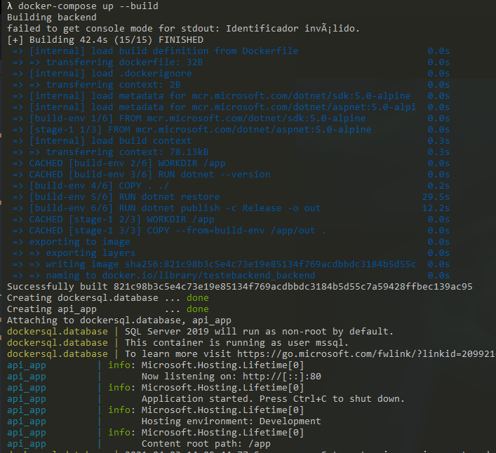
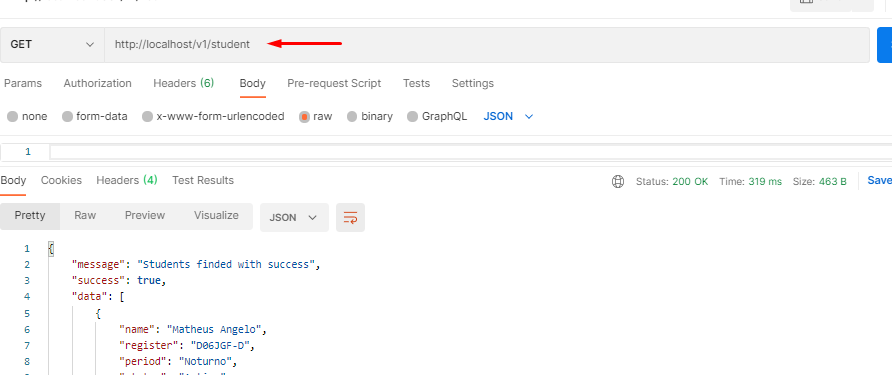

# Teste prático - BACKEND

## Descição

Projeto responsável pela gestão de alunos e suas respectivas disciplinas

## Tecnologias

[.NET 5 (Web API, MSTest)](https://dotnet.microsoft.com/download/dotnet/5.0) </br>
[SQL Server](https://www.microsoft.com/pt-br/sql-server/sql-server-downloads) </br>
[Docker](https://docs.docker.com/docker-for-windows/install/) </br>
[Flunt](https://www.nuget.org/packages/Flunt/) </br>


## Recursos

### Banco de Dados

- Base: App
- Tabelas:

|Nome|Descrição|
| ----------- | ----------- |
|STUDENT|Entidade responsável pelos alunos|
|COURSE|Entidade responsável pelos cursos|
|SUBJECT|Entidade responsável pelas disciplinas|
|STUDENT_SUBJECT|Entidade responsável pelo relacionamento entre Aluno e Disciplina|

<br>

## Desenvolvimento

### Clonar o projeto

Primeiramente, clone o repositório [app-teste-pratico-backend](https://github.com/matheusangelo/TesteBackEnd.git)

```shell
git clone https://github.com/matheusangelo/TesteBackEnd.git
cd TesteBackEnd
```

O projeto em questão, foi utilizado docker para facilitar a utilização dos recursos como SQL Server / .NET em qualquer instância.
Com o docker e docker-compose instalado, executar os seguintes comandos na raiz do projeto:

```shell
docker-compose up --build
```




Após a construção do container, utilizar a url conforme a evidência:




## Swagger

### App Swagger

* [API App](https://localhost/swagger/index.html)

## Testes


Para rodar os testes, basta rodar o comando no terminal:

```shell
dotnet test
```
